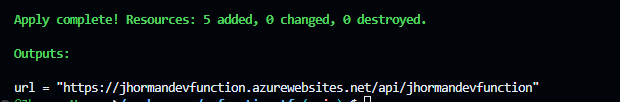
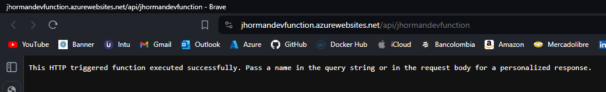
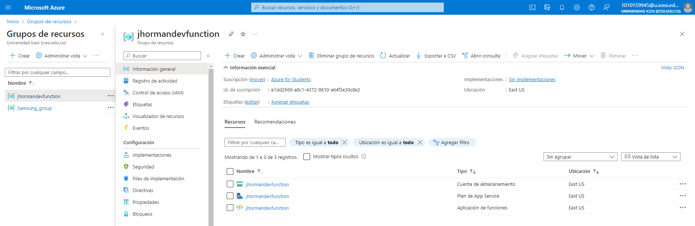
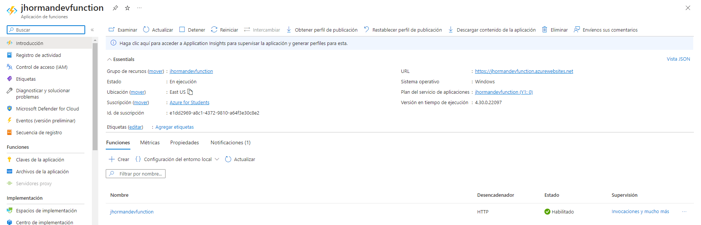
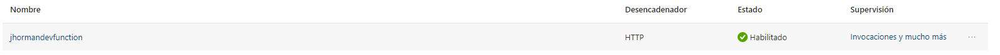
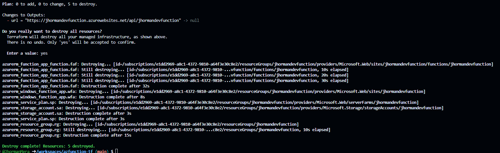
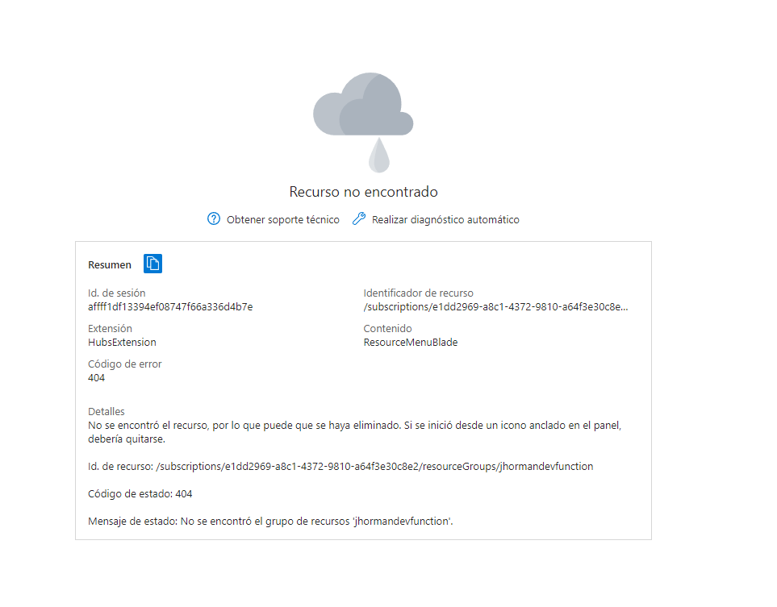

## Jhorman Mera A00369206

No apliqué el comando ```terraform destroy``` al inicio de la configuración debido a que realicé la configuración después de la explicación del ejercicio

### Evidencias de CLI del CodeSpace
* Terraform Apply


* Visualización de la página que responde a la URL

### Evidencias de la página de azure
* Grupo de recursos 

* Función


* Destrucción de los servicios

